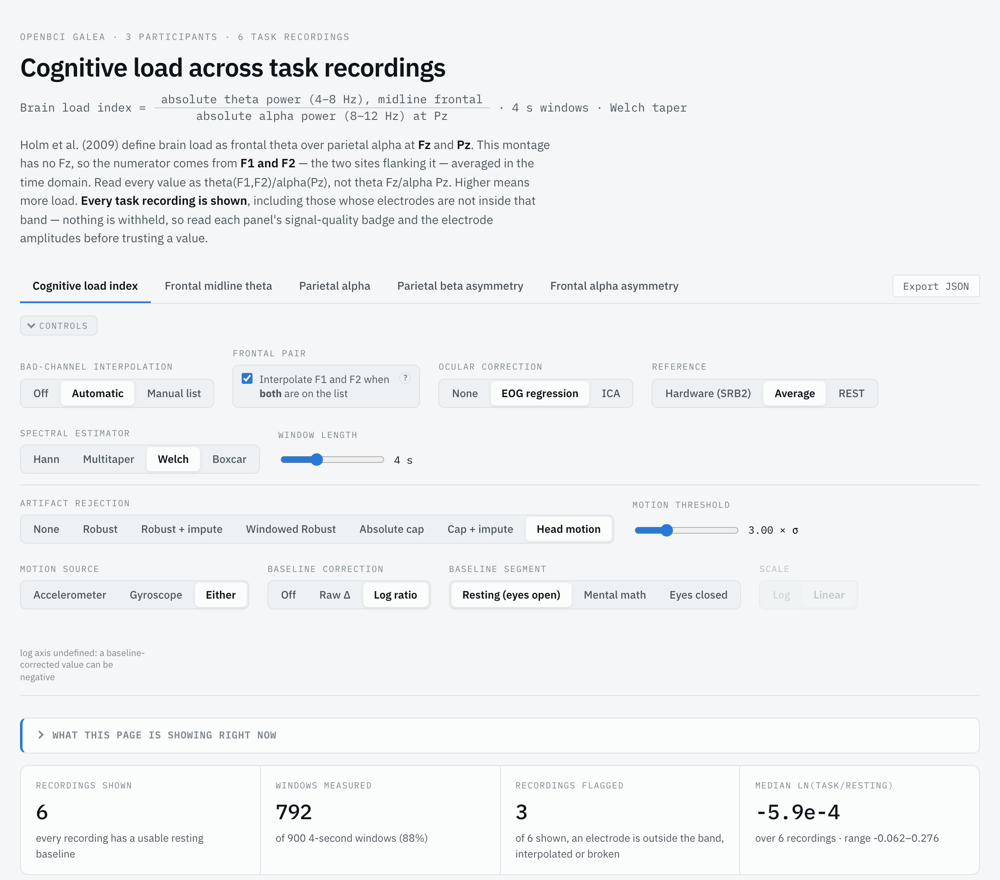
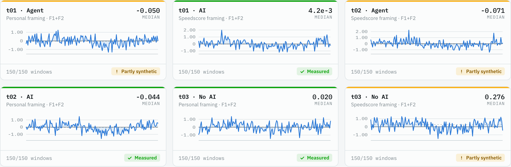
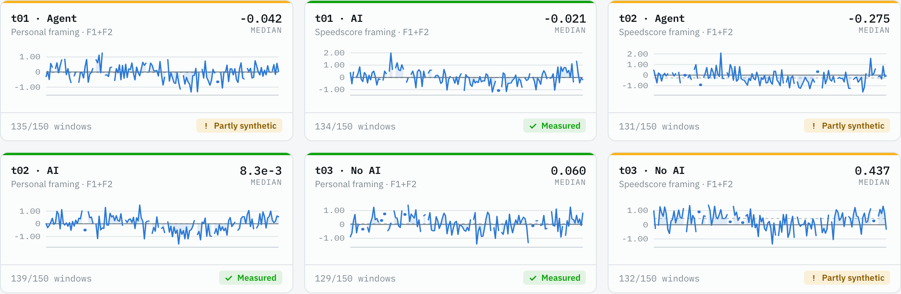
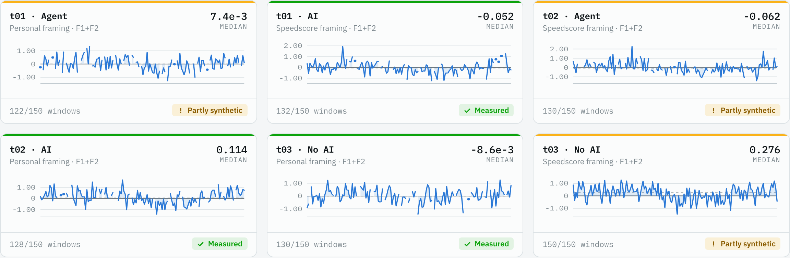
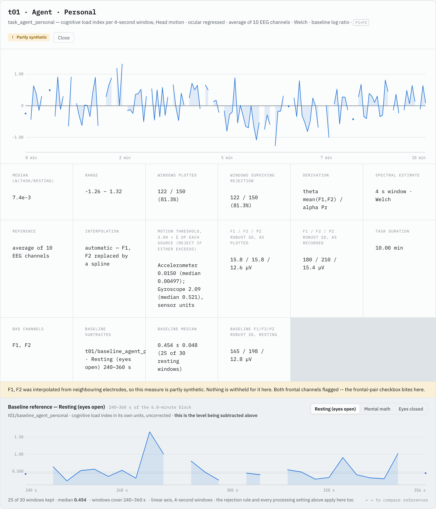

# Working with Galea EEG Data: Pitfalls, Pipeline and Dashboard

EPIC Lab, Oregon State University · Olivia Schutz, Rudrajit Choudhuri, Anita Sarma

EEG from a consumer research headset is easy to record and easy to misread. We built a dashboard to analyze 44 Galea recordings from a user study. Along the way we hit most of the usual EEG traps. This post covers what went wrong, how our pipeline handles each problem, and how the dashboard makes processing decisions visible instead of hiding them.

## What we recorded

We recorded EEG from 12 participants: 22 task recordings of 20 minutes each, plus one 6-minute baseline for each task. Each baseline was recorded in the same session, without adjusting the helmet. That makes 44 recordings.

The Galea montage has ten EEG channels: F1, F2, C3, C4, P3, P4, O1, O2, Cz and Pz. The sampling rate is 250 Hz, and the hardware reference is SRB2 on the left earlobe. There is no Fz, which matters later.

Each baseline is split into three 2-minute segments, in a set order: mental math, eye movements, then open-eye rest.

## Pitfalls at a glance

Several of these fail silently: the numbers still come out, they are just wrong. Each fix below is something we did in the pipeline or the dashboard.

| Pitfall | What goes wrong | What to do |
| --- | --- | --- |
| Recordings with mostly bad channels | Flat, zigzag or spiky channels produce meaningless band power | Inspect each recording's power spectrum before the pipeline. Exclude recordings where most or all channels fail |
| A few bad channels | One noisy channel skews every metric that uses it | Interpolate it by spherical spline, chosen from a manual list or by automatic detection |
| Interpolating both frontal channels | F1 and F2 are rebuilt from mostly the same neighbours, so they end up nearly identical. Asymmetry measures break | Keep a switch that controls whether to interpolate F1 and F2 when both are flagged |
| Line noise | 60 Hz mains noise and its harmonics contaminate the spectrum | Notch filter at 60 Hz and harmonics |
| Blinks and eye movement | Ocular artifacts leak into EEG. EOG channels are not always clean, and the literature uses different removal methods | Offer None, EOG regression and ICA, and compare them |
| Reference choice | Hardware, average and REST references give different values | Compute all three and let the reader switch |
| Spectral estimator and window length | Hann, multitaper, Welch and boxcar estimators, and 1 to 10 s windows, all shift the numbers | Precompute every option. Pin the MNE version, because its spectral defaults have changed between versions |
| Data loss | A window spanning a gap measures a step in the signal, not the brain | Take window times from recorded timestamps, never an assumed grid. Drop every non-contiguous window |
| Missing or extra markers | The task segment starts or ends in the wrong place | Repair a single marker if a full block follows it. Flag segments far shorter than expected. Fix false starts by hand |
| Large artifacts | Spikes inflate band power | Pick an artifact rejection mode, then check how many windows survive |
| Slow drift | A global threshold rejects drifting stretches that are fine | Use windowed robust rejection, with the threshold computed over 10, 20 or 30 s |
| Head motion without IMU data | Motion rejection silently does nothing if the aux file is missing | Confirm the aux data recorded properly before relying on head-motion rejection |
| Empty or mistyped manual interpolation list | No interpolation happens, with no warning | Check the list. The pipeline's validator exits on entries that match no recording or name an unknown channel |
| Interpolated data treated as measured | A metric built from rebuilt channels looks like a real measurement | Flag recordings as partly or fully synthetic, per metric |
| Judging amplitude against a fixed range | A fixed range does not fit every headset | Derive the plausible band from the run itself and read it as "unusual here", not "impossible". Needs at least 10 recordings |
| Wrong baseline segment | Correcting against the wrong minutes makes every corrected value wrong | Let the reader pick the segment. Set the segment bounds to match your own baseline protocol |
| Task without its baseline | No denominator for baseline correction | Exclude both halves of a pair together |
| Mislabelled recordings | Condition comes only from the folder name | Follow the naming grammar. The pipeline stops on a name it cannot parse |
| Counting recordings, not usable recordings | Group analysis looks larger than it is | Count only recordings where both the task and its baseline are plausible on that metric's own channels |

## Before the pipeline: look at every power spectrum

We looked at every recording before processing it, and some recordings could not be used. As a first pass we applied a 0 to 100 Hz bandpass filter and notch filters at 60 and 120 Hz. Then we plotted each recording's power spectrum and judged every channel on three things:

- **Smoothness, not flatness, from 0 to 30 Hz.** We only analyze bands below 30 Hz, so spikes above that range did not count. Repeated, noticeable spikes below 30 Hz made a channel a candidate for interpolation.
- **Power in line with the other channels.** A channel with noticeably higher power than the rest was flagged for interpolation.
- **A realistic wiggle.** A healthy channel is neither completely flat nor a clear, regular zigzag.

If most or all of a recording's channels failed these checks, we called it unrecoverable and excluded it. For every baseline/task pair that remained, we wrote down which channels to interpolate. That hand-built list becomes the dashboard's Manual List option.

This step cannot be skipped. The pipeline can flag bad channels automatically, but only the spectra told us which recordings were beyond saving.

## The pipeline, step by step

A Python script turns raw recordings into every metric we report. Wherever a choice changes the numbers and the literature disagrees, the pipeline computes every option instead of picking one. Steps run in this order:

1. **Load the EXG file** for each recording. Window times come from the recorded timestamps, never from an assumed grid. Spreading a duration evenly over windows puts a window minutes out of place once a recording has any gap.
2. **Segment on markers.** Marker 8.0 marks the start and end of each task and baseline. A recording with only one marker is repaired if a full block follows it. Extra markers are ignored, and a segment far shorter than expected is flagged.
3. **Build the MNE data object.** The MNE library needs it to compute everything that follows.
4. **Notch filter at 60 Hz and harmonics** to remove line noise.
5. **Bandpass filter at 0.5 to 100 Hz.**
6. **Ocular correction: None, EOG regression, or ICA fitted on the eye channels.** Our EOG data was not always clean, and the EEG papers we read remove blinks in different ways.
7. **Detect and interpolate bad channels: Off, Automatic, or Manual List.** Manual List is the one built from the spectra. Automatic flags any EEG channel whose log10 standard deviation sits more than 3.29 robust-z from the median of that pair's channels. Flagged channels are rebuilt by spherical spline. Detection runs once per task/baseline pair, so both halves get the same channels interpolated.
   - A checkbox decides whether to interpolate F1 and F2 when both are flagged. Several metrics, including an asymmetry measure, lean on these channels. Rebuilding both from mostly the same neighbours would push them toward the same values.
8. **Re-reference: hardware (SRB2), average, or REST.** REST tries to construct a truly neutral reference.
9. **Epoch and estimate band power.** Epochs default to 4 s, and any length from 1 to 10 s is available. Hann, multitaper, Welch and boxcar estimators are offered, since all appear in the EEG literature. Any window whose samples are not contiguous in real time is excluded, under every setting.
10. **Compute the five metrics:** cognitive load index, frontal midline theta, parietal alpha, parietal beta asymmetry, and frontal alpha asymmetry.

The cognitive load index follows Holm et al. (2009), defined as frontal theta at Fz over parietal alpha at Pz. Galea has no Fz. So the numerator is the mean of F1 and F2, averaged sample by sample in the time domain before the FFT. A rig with a real Fz, or a different montage, means changing the analysis, not just a constant.

Two safeguards come from the repo. Pin your MNE version, because its spectral defaults have changed between versions. Every run also checks that its default settings reproduce MNE's own estimator, and the dashboard refuses to build if they do not.

## What is precomputed and what is computed live

Settings that change the underlying values are precomputed. Settings that only correct or threshold existing values run live in the browser. The pipeline computes every option of five settings across the whole dataset and writes the results to files. The dashboard applies the other two as you click.

| Precomputed by the pipeline | Computed live in the dashboard |
| --- | --- |
| Bad-channel interpolation | Artifact rejection |
| Ocular correction | Baseline correction |
| Reference |  |
| Spectral estimator |  |
| Window length |  |

This split is why the dashboard is one HTML file. You can open it from disk and share it without running a server. In the synthetic build, the 4 s window is embedded in the page. The other nine window lengths load from a folder next to it when you move the slider.

## How to visualize it: the dashboard

The dashboard shows every task recording and makes every processing choice a control you can flip. Each of the five metrics has its own tab. Above the charts sit the controls for all seven settings. Below them is one panel per recording, with that recording's trace over the task, its median value, and how many windows were measured.

Every recording is shown, including ones whose electrodes fall outside the expected range. Nothing is withheld. Instead, each panel carries a signal-quality badge to read before trusting the value.

All screenshots below come from the repo's synthetic sample dataset, not from our study participants.



*The top of the page. The formula and its caveats sit above the tabs. The summary tiles show what the current settings keep: here, 792 of 900 four-second windows.*

### The two live settings

**Artifact rejection** removes windows with large spikes:

- **None.**
- **Robust:** rejects a window if any electrode's amplitude is more than 5 standard deviations from its typical value. A slider changes the threshold.
- **Windowed robust:** the same, with the standard deviation computed within a 10, 20 or 30 s window, so drift causes fewer rejections.
- **Absolute cap:** rejects any window where an electrode exceeds a hard amplitude cap that you choose.
- **Head motion:** uses the aux file's accelerometer and gyroscope data to reject windows where motion is higher than average. A slider sets the threshold.

Here are the same six recordings under two artifact rejection settings. Compare them and decide for yourself.



*Artifact rejection: None. Every panel keeps 150 of 150 windows.*



*Artifact rejection: Robust, 5 standard deviations. Panels keep 129 to 139 of 150 windows, and medians move. One No AI recording goes from 0.276 to 0.437.*

**Baseline correction** chooses what each task is compared against: the mental math segment, the closed-eyes segment (the last 15 seconds of the eye-movement segment), the open-eye rest segment, or none. You can correct by plain subtraction or by log ratio. The asymmetry measures already are log ratios, so they only allow subtraction.

### Data-quality flags

- **Fully synthetic:** every channel used for a metric was interpolated. Do not trust that value.
- **Partly synthetic:** at least one channel used for the metric was interpolated.
- **High amplitude:** a channel's amplitude falls outside the normal range for this dataset. That does not mean the measurement is impossible, only that it is unusual here.

Also check the windows-measured count on each panel. It tells you what share of the recording survived your artifact rejection setting.



*Default settings (head-motion rejection). Each panel's footer shows the windows kept and a badge: green Measured or amber Partly synthetic.*

Selecting a panel opens the full view for that recording. It lists every setting behind the number, the bad channels, the electrode amplitudes, and the baseline segment being subtracted.



*Recording t01, Agent arm. Both F1 and F2 were flagged and interpolated, so the panel is marked Partly synthetic. 122 of 150 windows survived. The resting baseline below it kept 25 of 30 windows.*

## Limitations and lessons learned

The dashboard is built around our study, and two of its failure modes give no warning.

- **Data must follow our structure and naming.** The README describes the folder layout and naming conventions.
- **Manual inspection still comes first.** Some recordings will not be usable, and only the power spectra show which ones.
- **It computes our five metrics only.** Other studies will care about different things.
- **It runs no statistics.** It makes no comparisons between recordings, other than each task against its own baseline.
- **Artifact rejection is aggressive.** In our experience, most modes reject a large share of the data. Check the windows-measured count for the mode you pick.
- **Head-motion rejection can silently do nothing.** If no IMU data was recorded, or no aux file exists, rejection is skipped. The only sign is a small line of text in that recording's expanded view. Make sure the aux data recorded properly if you plan to use this mode.
- **An empty Manual List silently does nothing.** With the interpolation mode set to Manual List and no list given, no interpolation happens and no warning appears.

## Beyond the data: the headset

Some problems start before any processing, with how the headset fits.

### Using the headset in user studies

- **Curly hair.**
- **The helmet moving during the study.**
- **It cannot be worn with glasses, and it is uncomfortable for people with large heads.**

## Try it yourself: set up the dashboard step by step

You can have the sample dashboard open in a few minutes, with no EEG data and no coding. The code is on GitHub at [oeschutz/Sample\_EEG\_Dashboard](https://github.com/oeschutz/Sample_EEG_Dashboard). The steps below build the dashboard from synthetic sample data, the same data as in the screenshots above.

**What you need:** a computer with Python 3, plus the Terminal app on Mac (or Command Prompt on Windows). On Windows, type `python` wherever these steps say `python3`, and `copy` wherever they say `cp`.

### Step 1. Check that Python is installed

Open Terminal and type:

```bash
python3 --version
```

If you see a version number such as `Python 3.11.x`, move on. If you see `command not found`, install Python from [python.org](https://www.python.org/downloads/) and try again.

### Step 2. Download the code

On the GitHub page, click the green **Code** button, then **Download ZIP**. Unzip it. You get a folder called `Sample_EEG_Dashboard-main`.

### Step 3. Go into that folder in Terminal

Type `cd`, then a space, then the folder's location. If it sits in your Downloads folder:

```bash
cd ~/Downloads/Sample_EEG_Dashboard-main
```

Tip: on a Mac you can type `cd ` and then drag the folder into the Terminal window to fill in its path.

### Step 4. Install NumPy

NumPy is the only extra package the sample route needs:

```bash
python3 -m pip install numpy
```

### Step 5. Generate the sample data

```bash
python3 generate_template_data.py --out template_run
```

This takes a few seconds and creates a new folder, `template_run`, with an `outputs` folder inside it.

### Step 6. Copy the builder next to the sample data

```bash
cp build_dashboard.py template_run/
```

The builder only looks for data in its own folder, so it must sit beside `outputs`.

### Step 7. Build the dashboard

```bash
cd template_run
```

```bash
python3 build_dashboard.py
```

You should see `Wrote .../dashboard.html (5.6 MB)`. You will also see a `WARNING` about 160 arrays the sweep did not produce. That is expected: one sample recording deliberately has no head-motion data.

### Step 8. Open it

Double-click `dashboard.html` in the `template_run` folder. It opens in your web browser, and no server is needed. Keep the `dashboard_data` folder next to it, because the window-length slider loads its other settings from there.

### If something goes wrong

| You see | What it means | Fix |
| --- | --- | --- |
| `python3: command not found` | Python is not installed | Install it from python.org (Step 1) |
| `No module named numpy` | NumPy is missing | Run Step 4 |
| `FileNotFoundError` on `outputs/cognitive_load.json` | The builder ran in the wrong folder | Do Step 6, then run Step 7 inside `template_run` |
| A banner when you move the window-length slider | `dashboard_data` is not next to the HTML file | Keep both in the same folder |

### Using your own recordings

The real pipeline, `pipeline.py`, turns raw Galea recordings into the same `outputs` folder. It needs more setup: MNE, SciPy and pandas, recordings in a fixed folder and naming layout, and at least 10 recordings. Our run used Python 3.13.7 and MNE 1.11.0, and took about 40 minutes for 49 recordings. The repo's README walks through it.

The builder never reads raw EEG. Any processing code that writes these four outputs gets the dashboard, and `dashboard_template.json` documents every field:

```
outputs/cognitive_load.json
outputs/baselines.json
outputs/variants/index.json
outputs/variants/*_eNN.N.npz
```
